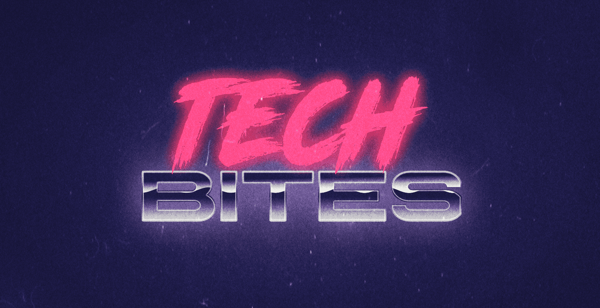

## What is in here?

The digital assets for the series of infographics I produce. The goal of these is to provide insight on tech, tools, and techniques in easy to digest formats.

## Infographics table of content

All of the content will be released both in English and Spanish and you can find it here:

- 🇬🇧 English version
  - [Serverless 101](./EN/serverless)
  - [Cloud 101](./EN/cloud-computing)
- 🇲🇽 Spanish version
  - [Informática sin servidor 101](./ES/serverless)
  - [La nube 101](./ES/cloud-computing)

✨🙋🏻‍♀️ Want to translate into other languages? Let me know!

## 🙌🏼 Contributing

If you want to suggets a topic to make an infographic on please use the `new topic` template in this repo [issues][issues] ✨.

You can find the contributing guidelines [here](./CONTRIBUTING.md).

We are now accepting translations. Please check the contributing guidelines first and then use the `translation` template in this repo [issues][issues]. 🌎🌍🌏

## 📝 Further resources

- ☁️ [Azure fundamentals interactive tutorial](https://docs.microsoft.com/learn/paths/azure-fundamentals/?WT.mc_id=tech-bites-github-taallard)
- ⚡️ [Azure serverless computing](https://azure.microsoft.com/en-gb/overview/serverless-computing/?WT.mc_id=tech-bites-github-taallard)
- 🐍 [Python on Azure](https://azure.microsoft.com/en-gb/develop/python/)
  
## 📃 Licensing

- All the content here has a [CC-BY 4.0 license](https://creativecommons.org/licenses/by/4.0/).
- You can use, print, share and modify but make sure to keep the attribution to the original source.

[issues]: https://github.com/trallard/tech-bites/issues
[link_repo]: https://github.com/trallard/tech-bites